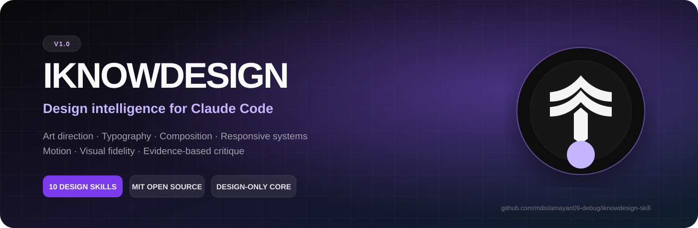

<div align="center">
  

  <p><strong>A design-only Agent Skills library for art direction, typography, composition, responsive hierarchy, motion, brand systems, visual fidelity, and evidence-based critique.</strong></p>

  <p>
    
    <a href="LICENSE"></a>
    
    
  </p>
</div>

---

## Why Iknowdesign exists

Most AI-generated interfaces fail in predictable ways: generic SaaS layouts, repeated card anatomy, weak typographic hierarchy, decorative gradients without purpose, desktop designs merely squeezed onto mobile, and “polish” that cannot survive a screenshot comparison.

**Iknowdesign Skill v1 is built to fight that failure mode.** It gives Claude Code and compatible Agent Skills runtimes a focused design system for choosing a truthful visual premise, exploring distinct directions, building a coherent visual grammar, and refusing to call work finished until the rendered result can be defended with visible evidence.

It is intentionally **design-only**. It does not attempt to become a project manager, backend framework, migration engine, prompt router, or general software-development methodology.

## Quick start

```bash
git clone -b iknowdesign-skill https://github.com/mdislamayan09-debug/codexskillfiles.git iknowdesign-skill
cd iknowdesign-skill
claude plugin install .
```

Install only the primary skill:

```bash
npx skills add . --skill iknowdesign
```

## What it improves

- Design premise and art direction
- Domain-aware visual decisions
- Anti-template composition
- Typography and optical balance
- Color behavior and material logic
- Imagery, crop, and asset direction
- Responsive recomposition
- Interaction states and motion
- Screenshot fidelity
- Evidence-based critique

## Design method

1. Establish visual truth: product, audience, content, domain, constraints, and references.
2. Write a design premise that defines the central visual idea.
3. Explore genuinely different structures and attitudes—not palette swaps.
4. Choose one memorable, subject-specific signature move.
5. Define type, color, imagery, spacing, states, motion, and responsive rules as one grammar.
6. Build a representative vertical slice before scaling the system.
7. Recompose for mobile instead of shrinking desktop.
8. Compare rendered evidence rather than trusting source-code confidence.
9. Score the result across eight visual-quality dimensions.
10. Use independent art-direction, critique, research, and motion review.

## Included design skills

| Skill | Role |
|---|---|
| `iknowdesign` | Primary design core |
| `motion-design` | Motion systems and choreography |
| `image-to-code` | Responsive visual fidelity from references |
| `imagegen-frontend-web` | Website and section concept direction |
| `imagegen-frontend-mobile` | Mobile screens and flow concepts |
| `brandkit` | Brand identity and visual-language systems |
| `stitch-design-taste` | Google Stitch design systems and handoffs |
| `minimalist-ui` | Context-sensitive minimalist overlay |
| `industrial-brutalist-ui` | Context-sensitive industrial/brutalist overlay |
| `high-end-visual-design` | Restrained premium visual overlay |

## Quality gate

Every design is scored from 0–5 across:

1. Relevance
2. Composition
3. Typography
4. Color and material
5. Imagery
6. Responsive design
7. Interaction and states
8. Originality and coherence

A passing design requires **32/40 or higher**, no dimension below **3/5**, no hard-stop defect, desktop and mobile evidence, and direct source-to-render comparison whenever a visual reference exists.

## Domain intelligence

Iknowdesign changes its judgment for SaaS, editorial, commerce, hospitality, finance, healthcare, developer tools, and creative portfolios. These are lenses—not templates. The same centered hero, card grid, font pair, or palette must not be forced onto every product.

## Anti-template rules

The primary skill explicitly detects repeated section formulas, identical card anatomy, generic centered heroes, meaningless pills and fake metrics, mirrored section repetition, arbitrary content replacement, trend stacking, decorative overload, and desktop layouts compressed onto mobile.

Consistency is valuable when it encodes a system. Sameness is a failure when it hides the absence of an idea.

## Open source

Iknowdesign Skill is released under the MIT License. Public maintenance is led by [@mdislamayan09-debug](https://github.com/mdislamayan09-debug). Original lineage and third-party attribution are preserved in the source package.

## Validation

The v1 source has passed official Agent Skills validation, Claude Code strict plugin validation, exact discovery of ten skills, fourteen source test suites, JSON/Python integrity checks, read-only agent permission tests, ZIP safety checks, SHA-256 verification, and reproducible builds.

---

<div align="center">
  <p><strong>Know the product. Know the audience. Know the design.</strong></p>
</div>
